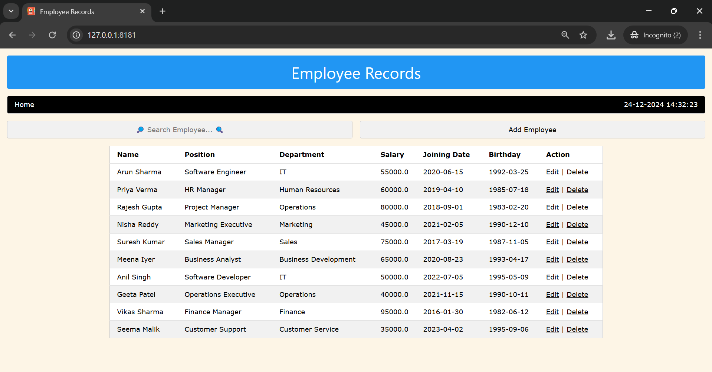
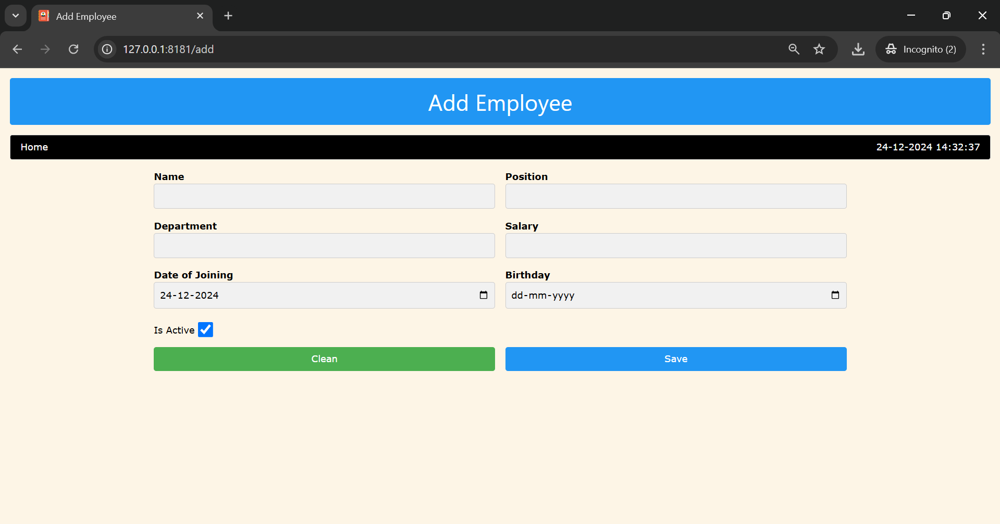
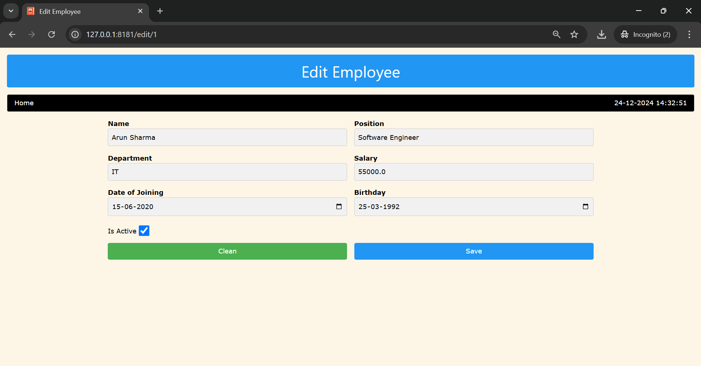

# Employee Management System

This project is a simple Employee Management System built with **Flask** and **SQLAlchemy** to manage employee records such as name, position, department, salary, date of joining, birthday, and status. The application supports CRUD operations (Create, Read, Update, Delete) for employee records.

---

## Features

- **Add Employee**: Add a new employee record with essential details.
- **Edit Employee**: Edit existing employee records.
- **Delete Employee**: Delete employee records.
- **Search**: Search employees based on their name, position, or department.
- **View Employee List**: View a list of all employees in a table format.

---

## Technologies Used

- **Python**: The backend logic is written in Python.
- **Flask**: The web framework used to build the application.
- **SQLAlchemy**: The ORM (Object-Relational Mapping) tool used to interact with the SQLite database.
- **Flask-WTF**: For form handling and validation.
- **WTForms**: For creating web forms.
- **W3.CSS**: For styling the application with responsive design.

---

## Installation

### Prerequisites

Make sure you have **Python 3** installed on your system.

1. Clone the repository to your local machine:

   ```bash
   git clone https://github.com/jeetendra29gupta/employee-management-system-wtf.git
   cd employee-management-system-wtf
   ```

2. Install the required dependencies using `pip`:

   ```bash
   pip install -r requirements.txt
   ```

3. Set up the environment variables:

   - You can configure environment variables for Flask, such as `SECRET_KEY` and database URI. In the project root, create a `.env` file with the following content:

     ```
     FLASK_APP=app.py
     FLASK_ENV=development
     SECRET_KEY=your_secret_key
     ```

4. Create the SQLite database and tables:

   ```bash
   python
   >>> from app import db
   >>> db.create_all()
   ```

## Running the Application

To run the application, use the following command:

```bash
python main_app.py
```

This will start the Flask development server on `http://localhost:8181`.

## Usage

- Open your browser and visit `http://localhost:8181`.
- You will be able to:
  - **Add a new employee** by clicking the "Add Employee" button.
  - **Edit or delete employee records**.
  - **Search for employees** based on their name, position, or department.

---

## Directory Structure

```
employee-management-system/
│
├── main_app.py             # Main Flask app file
├── models.py               # Defines database models and ORM classes
├── forms.py                # Contains form classes for employee data
├── routes.py               # Routes for handling different views and actions
├── static/                 # Contains static files like images, CSS, JS
│   └── images/             # Employee logo and other images
│
├── templates/              # Contains HTML templates
│   └── layout.html         # Base HTML layout
│   └── index.html          # Employee records table and main page
│   └── employee_form.html  # Form for adding/editing employee
│
├── requirements.txt        # Python dependencies
└── .env                    # Environment configuration (optional)
```

---

## Screenshot
> Employee Records
> 

> Add Employee
> 

> Edit Employee
> 

---
